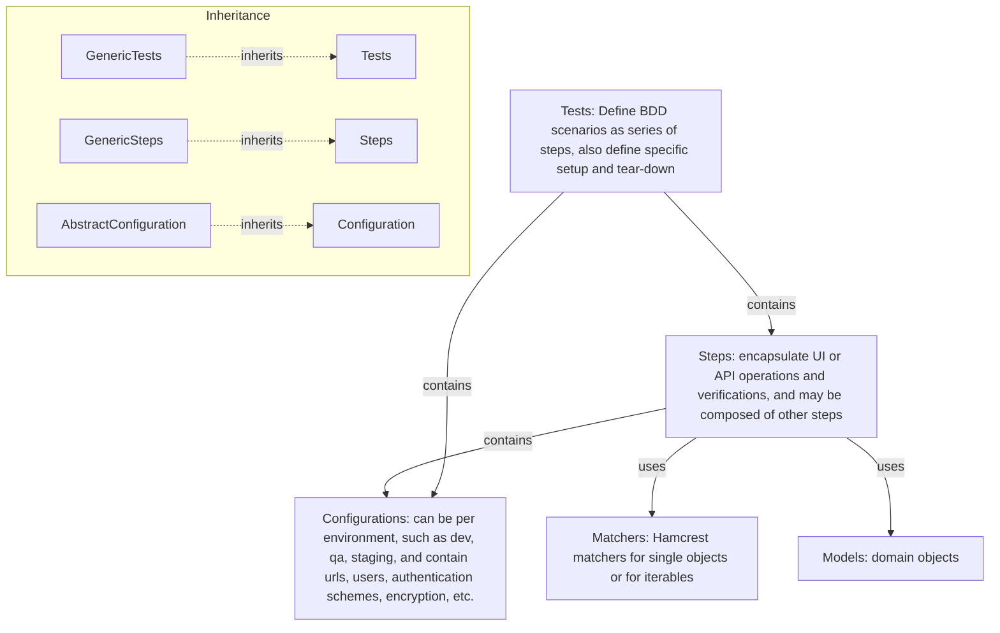
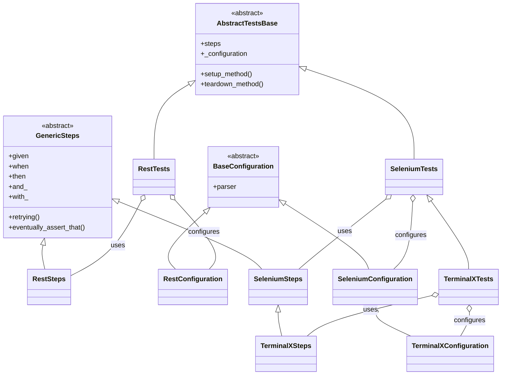

# QA Automation for Python

[](https://github.com/QA-Automation-Starter/qa-automation-python/actions/workflows/build.yml)
[](https://github.com/QA-Automation-Starter/qa-automation-python/actions/workflows/release.yml)
[](https://pypi.org/project/qa-testing-utils/)
[](https://pypi.org/project/qa-pytest-commons/)
[](https://pypi.org/project/qa-pytest-rest/)
[](https://pypi.org/project/qa-pytest-webdriver/)
[](LICENSE)


This monorepo contains modular, reusable Python packages for building structured, maintainable, BDD-style automated tests using `pytest`, `Hamcrest`, and related tooling.
It is designed to support test automation for diverse technologies like REST APIs, web UI (Selenium), messaging (RabbitMQ), and more.

---

## 📦 Project Structure

```
qa-automation-python/
├── qa-testing-utils/        # Shared low-level utility functions
├── qa-pytest-commons/       # Technology-agnostic test infrastructure
├── qa-pytest-rest/          # REST-specific steps and config
├── qa-pytest-webdriver/     # Selenium-specific implementation
├── qa-pytest-template/      # Cookiecutter project template
├── qa-pytest-examples/      # Usage examples for application test projects
├── pyproject.toml           # Root environment definition for PDM
└── .vscode/                 # Recommended settings for VSCode integration
```

---

##   Architecture

> NOTE: Support for additional technologies, e.g RabbitMQ, can be added by sub-classing these classes and adding specific steps, setup/teardown, and configuration. This allows reusing the basic configuration, reporting, logging, and retrying mechanisms. Further, application tests, steps, and configurations reuse by subclassing from technologies.



---


### Extending the Framework

> NOTE: Support for additional technologies, e.g RabbitMQ, can be added by sub-classing these classes and adding specific steps, setup/teardown, and configuration. This allows reusing the basic configuration, reporting, logging, and retrying mechanisms. Further, application tests, steps, and configurations reuse by subclassing from technologies.



> NOTE: To add support for a new technology (e.g., messaging, database), create:
> - `MyTechConfiguration(BaseConfiguration)`
> - `MyTechSteps(GenericSteps[MyTechConfiguration])`
> - `MyTechTests(AbstractTestsBase[MyTechSteps, MyTechConfiguration])`
> This pattern ensures you reuse the core BDD, configuration, and reporting mechanisms.

**Key Classes (with links to source code):**

| Class | Description | Source |
|-------|-------------|--------|
| `AbstractTestsBase` | Base for all test scenarios; holds steps and config | [abstract_tests_base.py](qa-pytest-commons/src/qa_pytest_commons/abstract_tests_base.py) |
| `GenericSteps` | Base for all step implementations; provides BDD keywords | [generic_steps.py](qa-pytest-commons/src/qa_pytest_commons/generic_steps.py) |
| `BaseConfiguration` | Base for all configuration objects | [base_configuration.py](qa-pytest-commons/src/qa_pytest_commons/base_configuration.py) |
| `RestTests` | REST-specific test base | [rest_tests.py](qa-pytest-rest/src/qa_pytest_rest/rest_tests.py) |
| `RestSteps` | REST-specific steps | [rest_steps.py](qa-pytest-rest/src/qa_pytest_rest/rest_steps.py) |
| `RestConfiguration` | REST-specific configuration | [rest_configuration.py](qa-pytest-rest/src/qa_pytest_rest/rest_configuration.py) |
| `SeleniumTests` | Selenium-specific test base | [selenium_tests.py](qa-pytest-webdriver/src/qa_pytest_webdriver/selenium_tests.py) |
| `SeleniumSteps` | Selenium-specific steps | [selenium_steps.py](qa-pytest-webdriver/src/qa_pytest_webdriver/selenium_steps.py) |
| `SeleniumConfiguration` | Selenium-specific configuration | [selenium_configuration.py](qa-pytest-webdriver/src/qa_pytest_webdriver/selenium_configuration.py) |
| `TerminalXTests` | Example: custom UI test base | [terminalx_tests.py](qa-pytest-examples/src/qa_pytest_examples/terminalx_tests.py) |
| `TerminalXSteps` | Example: custom UI steps | [terminalx_steps.py](qa-pytest-examples/src/qa_pytest_examples/terminalx_steps.py) |
| `TerminalXConfiguration` | Example: custom UI configuration | [terminalx_configuration.py](qa-pytest-examples/src/qa_pytest_examples/terminalx_configuration.py) |

---


## 🚀 Quick Start (Locally with [PDM](https://pdm-project.org))

Open in CodeSpace or devcontainer and everything will get installed and configured,
otherwise:

0. Install Python 3.13 on your system

1. Install PDM:
   ```bash
   pipx install pdm[all]
   ```

2. Install dependencies:
   ```bash
   pdm install
   ```

3. Run all tests from the root:
   ```bash
   pdm run pytest
   ```
---

## 🧪 Releasing

1. branch
2. commit changes
3. pull request -- will trigger a build
4. build succeeds --> tag with vX.X.X, e.g. v1.2.3 -- will trigger a release
5. verify new versions appeared on https://pypi.org/
---


## 🏗 Adding a New Package

```bash
cd qa-automation-python
pdm plugin add pdm-init  # if not already available
pdm init  # or copy an existing module like qa-testing-utils
```

Then edit `pyproject.toml` accordingly.

---

## Reports

1. `report.html` is generated in the root folder; just open it in a browser
2. `allure-results/` is generated for Allure reporting (requires Allure server)

## Example Tests

```python
def should_find(self):
    self.login_section(random.choice(self._configuration.users))
    for word in ["hello", "kitty"]:
        (self.steps
            .when.searching_for(word)
            .then.the_search_hints(
                yields_item(contains_string_ignoring_case(word))))
```

```python
def should_add(self):
    random_pet = SwaggerPetstorePet.random()
    (self.steps
        .when.adding(random_pet)
        .then.the_available_pets(yields_item(is_(random_pet))))
```

## Requirements

- Python 3.13
- Google Chrome
- PDM (Python package manager)

## TODO

- Add GitHub Actions workflow for CI
- Add browser matrix support (Safari, Edge)
- Make the BDD intro words appear in Allure report
- Extend test examples (API + UI)

## ✅ License

This project is licensed under the Apache 2.0 License.