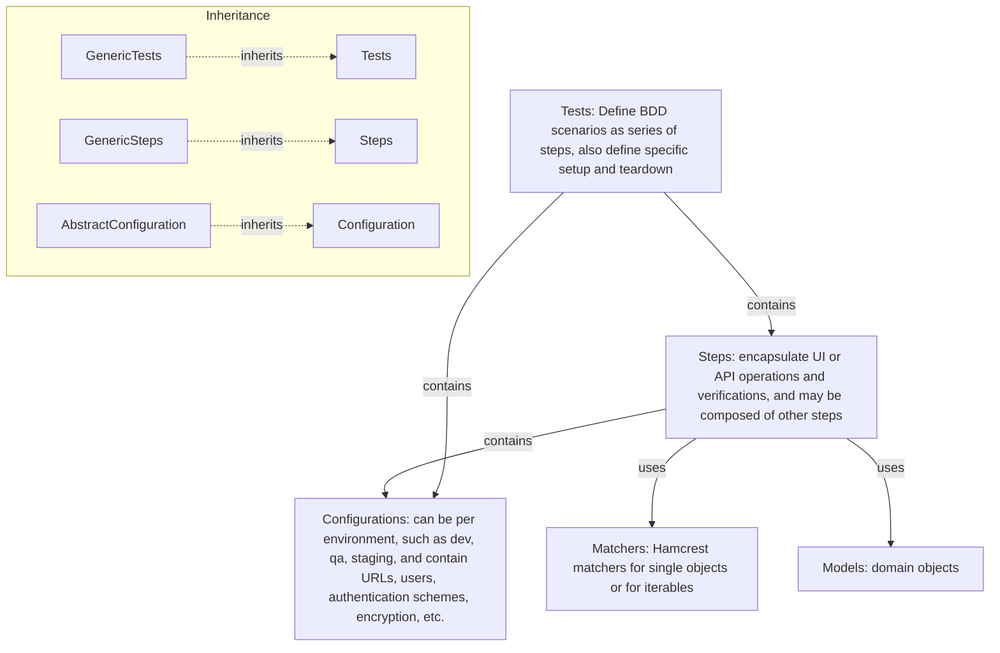

#   Architecture

> Support for additional technologies, e.g. Playwright, ElasticSearch, can be added by sub-classing these classes and adding specific steps, setup/teardown, and configuration. This allows reusing the basic configuration, reporting, logging, and retrying mechanisms. Further, application tests, steps, and configurations reuse by subclassing from technologies.



---

## Extending the Framework

> To add support for a new technology (e.g., messaging, database), create:
> - `MyTechConfiguration(BaseConfiguration)`
> - `MyTechSteps(GenericSteps[MyTechConfiguration])`
> - `MyTechTests(AbstractTestsBase[MyTechSteps, MyTechConfiguration])`
> This pattern ensures you reuse the core BDD, configuration, and reporting mechanisms.


---

## Key Classes

| Class | Description |
|-------|-------------|
| [`AbstractTestsBase`](api/qa-pytest-commons.md#qa_pytest_commons.AbstractTestsBase) | Base for all test scenarios; holds steps and config |
| [`GenericSteps`](api/qa-pytest-commons.md#qa_pytest_commons.GenericSteps) | Base for all step implementations; provides BDD keywords |
| [`BaseConfiguration`](api/qa-pytest-commons.md#qa_pytest_commons.BaseConfiguration) | Base for all configuration objects |
| [`RestTests`](api/qa-pytest-rest.md#qa_pytest_rest.RestTests) | REST-specific test base |
| [`RestSteps`](api/qa-pytest-rest.md#qa_pytest_rest.RestSteps) | REST-specific steps |
| [`RestConfiguration`](api/qa-pytest-rest.md#qa_pytest_rest.RestConfiguration) | REST-specific configuration |
| [`SeleniumTests`](api/qa-pytest-webdriver.md#qa_pytest_webdriver.SeleniumTests) | Selenium-specific test base |
| [`SeleniumSteps`](api/qa-pytest-webdriver.md#qa_pytest_webdriver.SeleniumSteps) | Selenium-specific steps |
| [`PlaywrightTests`](api/qa-pytest-playwright.md#qa_pytest_playwright.PlaywrightTests) | Playwright-specific test base |
| [`PlaywrightSteps`](api/qa-pytest-playwright.md#qa_pytest_playwright.PlaywrightSteps) | Playwright-specific steps |
| [`UiConfiguration`](api/qa-pytest-commons.md#qa_pytest_commons.UiConfiguration) | Shared UI configuration for both Selenium and Playwright |
| [`TerminalXConfiguration`](api/qa-pytest-examples.md#qa_pytest_examples.TerminalXConfiguration) | Example: custom UI configuration |

---

## Usage Examples

### TerminalX Tests

```python
--8<-- "terminalx_tests.py:class"
```

#### Browser Setup
For custom browser configuration (different browser, custom options), override `setup_method()` in your test class.
The base classes (`SeleniumTests`, `PlaywrightTests`) provide sensible Chrome/Chromium defaults.

#### The Configuration
The configuration is loaded from two sources, in this example:

1. `TerminalXConfiguration` class looks for a matching
`terminalx_configuration.ini` file under `configurations/`.
2. pytest could be launched with a `--config` parameter to override
this or add properties:
```bash
pytest --config selenium:browser_type=firefox qa-pytest-examples/tests/terminalx_tests.py::TerminalXTests
```

Any subclass of [`BaseConfiguration`](api/qa-pytest-commons.md#qa_pytest_commons.BaseConfiguration)
looks for a matching `ini` file, this way multiple configurations can be used.

If there is a `TEST_ENVIRONMENT` environment variable its value will be chained
to the path of `ini` file, this way one can select which configuration set
shall be used at runtime.

### Swagger Petstore Tests

```python
--8<-- "swagger_petstore_tests.py:class"
```

### Combined Tests

```python
--8<-- "combined_tests.py:class"
```

### RabbitMQ Self Tests

```python
--8<-- "rabbitmq_self_tests.py:class"
```


::: qa_testing_utils.pytest_plugin
    options:
      show_source: true

