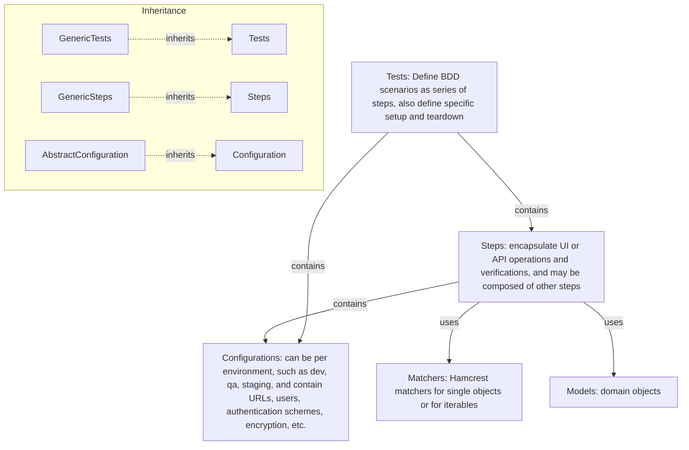
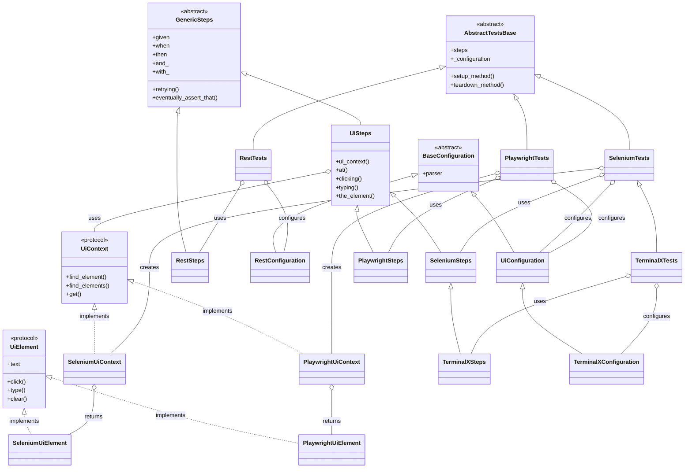

#   Architecture

> Support for additional technologies, e.g. Playwright, ElasticSearch, can be added by sub-classing these classes and adding specific steps, setup/teardown, and configuration. This allows reusing the basic configuration, reporting, logging, and retrying mechanisms. Further, application tests, steps, and configurations reuse by subclassing from technologies.



---

## Extending the Framework

> To add support for a new technology (e.g., messaging, database), create:
> - `MyTechConfiguration(BaseConfiguration)`
> - `MyTechSteps(GenericSteps[MyTechConfiguration])`
> - `MyTechTests(AbstractTestsBase[MyTechSteps, MyTechConfiguration])`
> This pattern ensures you reuse the core BDD, configuration, and reporting mechanisms.



---

## Key Classes

| Class | Description |
|-------|-------------|
| [`AbstractTestsBase`](api/qa-pytest-commons.md#qa_pytest_commons.AbstractTestsBase) | Base for all test scenarios; holds steps and config |
| [`GenericSteps`](api/qa-pytest-commons.md#qa_pytest_commons.GenericSteps) | Base for all step implementations; provides BDD keywords |
| [`BaseConfiguration`](api/qa-pytest-commons.md#qa_pytest_commons.BaseConfiguration) | Base for all configuration objects |
| [`RestTests`](api/qa-pytest-rest.md#qa_pytest_rest.RestTests) | REST-specific test base |
| [`RestSteps`](api/qa-pytest-rest.md#qa_pytest_rest.RestSteps) | REST-specific steps |
| [`RestConfiguration`](api/qa-pytest-rest.md#qa_pytest_rest.RestConfiguration) | REST-specific configuration |
| [`SeleniumTests`](api/qa-pytest-webdriver.md#qa_pytest_webdriver.SeleniumTests) | Selenium-specific test base |
| [`SeleniumSteps`](api/qa-pytest-webdriver.md#qa_pytest_webdriver.SeleniumSteps) | Selenium-specific steps |
| [`PlaywrightTests`](api/qa-pytest-playwright.md#qa_pytest_playwright.PlaywrightTests) | Playwright-specific test base |
| [`PlaywrightSteps`](api/qa-pytest-playwright.md#qa_pytest_playwright.PlaywrightSteps) | Playwright-specific steps |
| [`UiConfiguration`](api/qa-pytest-commons.md#qa_pytest_commons.UiConfiguration) | Shared UI configuration for both Selenium and Playwright |
| [`TerminalXConfiguration`](api/qa-pytest-examples.md#qa_pytest_examples.TerminalXConfiguration) | Example: custom UI configuration |

---

## Usage Examples

### Gherkin to Fluent API Mapping

BDD scenarios written in Gherkin map directly to fluent API method calls:

**Gherkin Scenario:**
```gherkin
Scenario: Publish and consume message
  Given a queue handler
  When publishing message "test_queue"
  And consuming
  Then the received messages contain a message "test_queue"
```

### Python implementation (from RabbitMqSelfTests::should_publish_and_consume)

```python
--8<-- "rabbitmq_self_tests.py:func"
```

**Key Points:**
- `.given` → Given steps (setup/preconditions)
- `.when` → When steps (actions)
- `.and_` → And steps (additional actions/verifications)
- `.then` → Then steps (verifications using hamcrest matchers)
- Method chaining enables readable, sequential flow
- Type-safe throughout (generics for domain objects)

**Stateful Scenarios:**
Integration scenarios are inherently stateful: the test class is responsible for managing the lifecycle of core resources (such as connections, clients, or handlers) and creates resource-specific handler objects (e.g., queue handler, topic handler, client). The steps class receives the handler via a dedicated method (e.g., `a_queue_handler`, `a_topic_handler`) and provides a fluent BDD API for all subsequent operations. This enables step chaining and ensures that asynchronous/background operations (like message consumption) are coordinated through the handler. Cleanup and teardown are managed by the test class, which ensures proper resource disposal even in partial failure states. This pattern applies to messaging (RabbitMQ, Kafka), REST sessions, browser contexts, and similar integration domains.

### TerminalX Tests

```python
--8<-- "terminalx_tests.py:class"
```

#### Browser Setup
For custom browser configuration (different browser, custom options), override `setup_method()` in your test class.
The base classes (`SeleniumTests`, `PlaywrightTests`) provide sensible Chrome/Chromium defaults.

#### The Configuration
The configuration is loaded from two sources, in this example:

1. `TerminalXConfiguration` class looks for a matching
`terminalx_configuration.ini` file under `configurations/`.
2. pytest could be launched with a `--config` parameter to override
this or add properties:
```bash
pytest --config selenium:browser_type=firefox qa-pytest-examples/tests/terminalx_tests.py::TerminalXTests
```

Any subclass of [`BaseConfiguration`](api/qa-pytest-commons.md#qa_pytest_commons.BaseConfiguration)
looks for a matching `ini` file, this way multiple configurations can be used.

If there is a `TEST_ENVIRONMENT` environment variable its value will be chained
to the path of `ini` file, this way one can select which configuration set
shall be used at runtime.

### Swagger Petstore Tests

```python
--8<-- "swagger_petstore_tests.py:class"
```

### Combined Tests

```python
--8<-- "combined_tests.py:class"
```

### RabbitMQ Self Tests

```python
--8<-- "rabbitmq_self_tests.py:class"
```


::: qa_testing_utils.pytest_plugin
    options:
      show_source: true

## Configuration File Discovery Pattern

All subclasses of `BaseConfiguration` automatically infer their configuration file location based on the module in which the configuration class is defined—not the test file location.

**Pattern:**

- The configuration file is expected at:

      <module_dir>/configurations/${TEST_ENVIRONMENT}/<module_name>.ini

  - `<module_dir>`: Directory where the configuration class's module is located
  - `${TEST_ENVIRONMENT}`: Optional environment subdirectory (e.g., dev, ci, prod)
  - `<module_name>.ini`: The stem of the configuration class's module file (e.g., `KafkaConfiguration` → `kafka_configuration.ini`)

**Example:**

If you use `KafkaConfiguration` from the `qa-pytest-kafka` module, the expected configuration file is:

    qa-pytest-kafka/src/qa_pytest_kafka/configurations/kafka_configuration.ini

or, if using environments:

    qa-pytest-kafka/src/qa_pytest_kafka/configurations/dev/kafka_configuration.ini

**Note:**
- The configuration file is **not** inferred from the test file location.
- This ensures that configuration is always colocated with the implementation module, supporting reuse and clarity across test modules.

## Error and Edge Case Handling (All Integration Modules)

For all integration modules (Kafka, RabbitMQ, REST, etc.), the following principles apply to error and edge case handling:

- **Propagate API exceptions or return values**: If an operation fails due to a test design error, invalid input, or system state (e.g., non-existent resource, invalid partition, serialization error, duplicate key), the module should propagate the underlying API exception or return value. This ensures failures are visible and actionable.
- **Fail fast**: Do not attempt to recover from permanent errors (e.g., configuration mistakes, resource not found, message too large). Surface the error immediately to the test.
- **No extra retrying at the BDD layer**: Do not wrap operations in additional retry logic unless the error is known to be transient and the underlying client does not already handle resilience. For most messaging and database clients, resilience is built-in; retrying at the BDD layer only delays test failure.
- **Descriptive errors**: Where possible, ensure that errors surfaced to the test are descriptive and actionable, aiding in rapid diagnosis.
- **Consistent pattern**: This approach ensures that all modules behave consistently, and test failures are clear and deterministic.