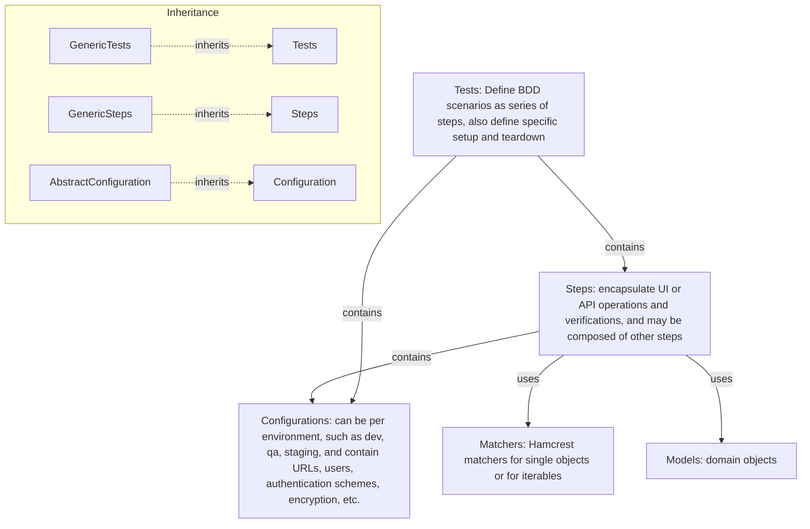
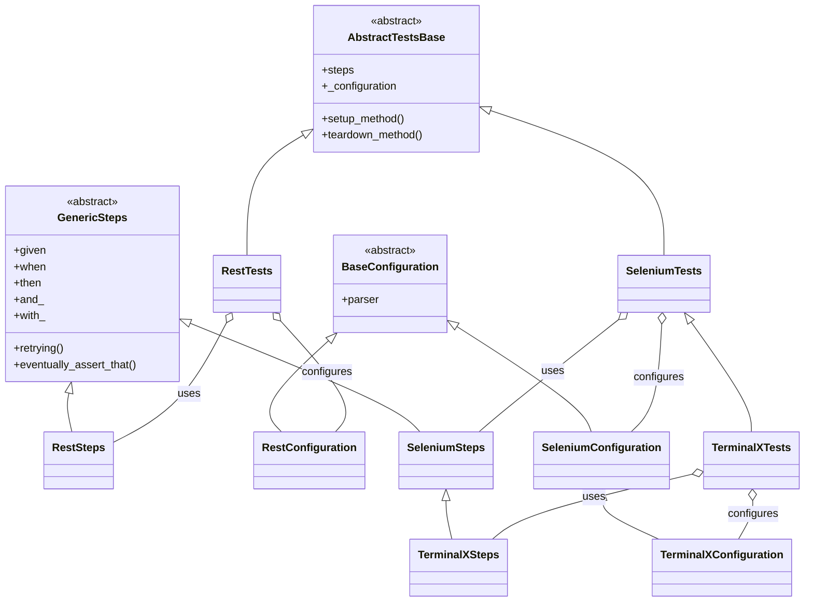

##   Architecture

> Support for additional technologies, e.g. RabbitMQ, can be added by sub-classing these classes and adding specific steps, setup/teardown, and configuration. This allows reusing the basic configuration, reporting, logging, and retrying mechanisms. Further, application tests, steps, and configurations reuse by subclassing from technologies.

---

## Extending the Framework

> To add support for a new technology (e.g., messaging, database), create:
> - `MyTechConfiguration(BaseConfiguration)`
> - `MyTechSteps(GenericSteps[MyTechConfiguration])`
> - `MyTechTests(AbstractTestsBase[MyTechSteps, MyTechConfiguration])`
> This pattern ensures you reuse the core BDD, configuration, and reporting mechanisms.

## Key Classes

| Class | Description | Source |
|-------|-------------|--------|
| `AbstractTestsBase` | Base for all test scenarios; holds steps and config | [abstract_tests_base.py](qa-pytest-commons/src/qa_pytest_commons/abstract_tests_base.py) |
| `GenericSteps` | Base for all step implementations; provides BDD keywords | [generic_steps.py](qa-pytest-commons/src/qa_pytest_commons/generic_steps.py) |
| `BaseConfiguration` | Base for all configuration objects | [base_configuration.py](qa-pytest-commons/src/qa_pytest_commons/base_configuration.py) |
| `RestTests` | REST-specific test base | [rest_tests.py](qa-pytest-rest/src/qa_pytest_rest/rest_tests.py) |
| `RestSteps` | REST-specific steps | [rest_steps.py](qa-pytest-rest/src/qa_pytest_rest/rest_steps.py) |
| `RestConfiguration` | REST-specific configuration | [rest_configuration.py](qa-pytest-rest/src/qa_pytest_rest/rest_configuration.py) |
| `SeleniumTests` | Selenium-specific test base | [selenium_tests.py](qa-pytest-webdriver/src/qa_pytest_webdriver/selenium_tests.py) |
| `SeleniumSteps` | Selenium-specific steps | [selenium_steps.py](qa-pytest-webdriver/src/qa_pytest_webdriver/selenium_steps.py) |
| `SeleniumConfiguration` | Selenium-specific configuration | [selenium_configuration.py](qa-pytest-webdriver/src/qa_pytest_webdriver/selenium_configuration.py) |
| `TerminalXTests` | Example: custom UI test base | [terminalx_tests.py](qa-pytest-examples/src/qa_pytest_examples/terminalx_tests.py) |
| `TerminalXSteps` | Example: custom UI steps | [terminalx_steps.py](qa-pytest-examples/src/qa_pytest_examples/terminalx_steps.py) |
| `TerminalXConfiguration` | Example: custom UI configuration | [terminalx_configuration.py](qa-pytest-examples/src/qa_pytest_examples/terminalx_configuration.py) |

---
