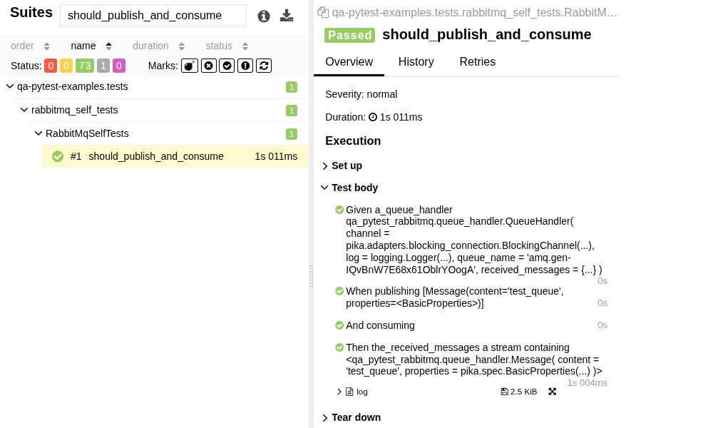

# QA Automation Starter for Python


**Modular Python packages for maintainable, BDD-style automated tests with [`pytest`](https://docs.pytest.org/), [`Hamcrest`](https://hamcrest.org/), [`Allure`](https://docs.qameta.io/allure/) reporting, and configurable logging.**

Technology-agnostic; example REST, Selenium, Playwright, and RabbitMQ implementations included.

## Example Allure Report


> see live [Example Allure Report](reports/index.html)

## Example Code
```python
--8<-- "rabbitmq_self_tests.py:func"
```

## Requirements

- Python 3.13
- [PDM](https://pdm-project.org) (Python package manager)

### Optional
- Google Chrome for local Selenium testing
- RabbitMQ for running local tests
- Allure for generating a nice test dashboard like above

---
